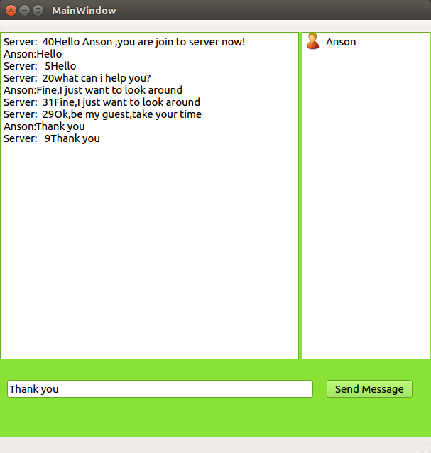

#**BoostAsioChat**
This is a chat application with **asynchronous server** and **asynchronous client**.
#**Techniques involved**
- Boost Asio network library
- MultiThread,mutex
- QT Client 

#**Brief Introduction**
##**Remarks**##
** Message from Server always preceded with a number suggesting the message's length **
* Log In Page                                                           

* Entering In,receiving a welcome message from server

* Communication,when client send message out,always received the same message back from server
 ,and server is also free to send message to client                                                      

