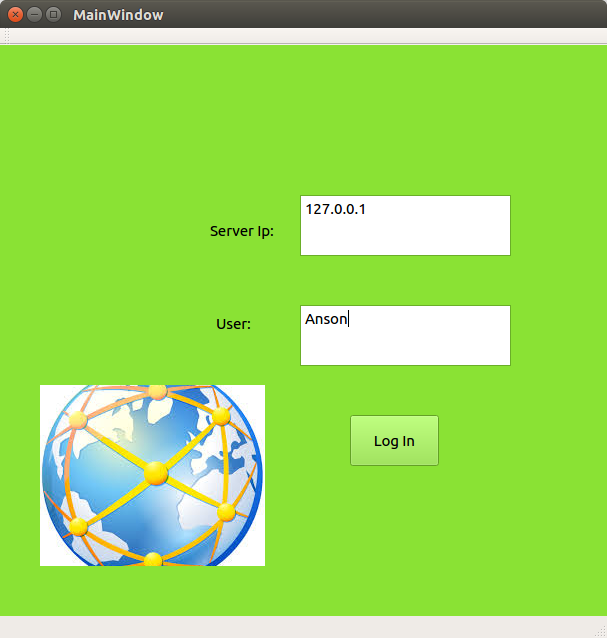

#**BoostAsioChat**
This is a chat application with asynchronous server and asynchronous client.
#**Techniques involved**
- Boost Asio network library
- MultiThread,mutex
- QT Client 

#**Brief Introduction**
* Log In Page                                                           

* Entering In,receiving a welcome message from server,the first digit represent the length of this message

* Communication,when client send message out,always received the same message back from server,and server is also free to send message to client,messages from server always preceded with a digit suggesting the length of corresponding message.

